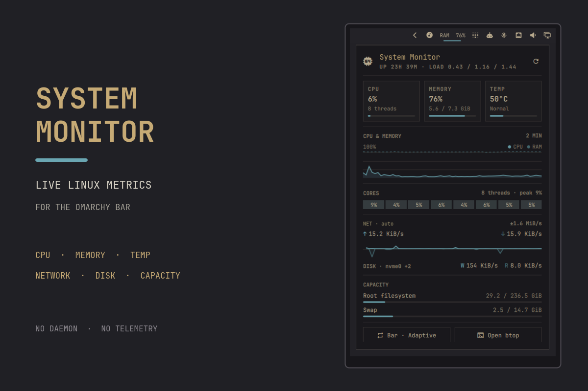
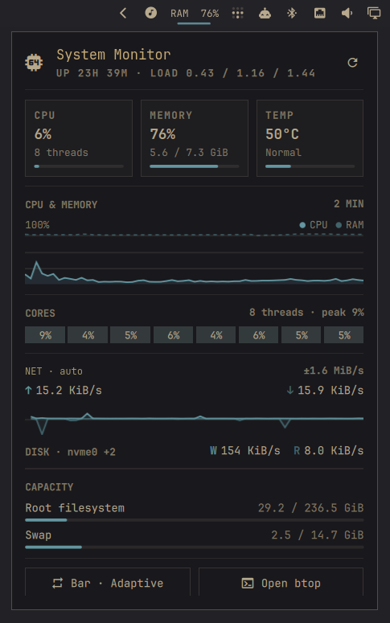

# System Monitor for Omarchy

[](https://omarchy.org/manual/shell-plugins/)
[](https://github.com/Harshith292002/omarchy-system-monitor/actions/workflows/validate.yml)
[](LICENSE)

A low-overhead dashboard for the Omarchy bar. System Monitor reads Linux
metrics directly from `/proc` and `/sys`, so it stays responsive without a
background daemon or telemetry service.



<p align="center"><sub>Built from a live Omarchy capture; system identifiers anonymized.</sub></p>

## Highlights

- Adaptive bar widget that can show CPU, memory, or both
- Expandable dashboard for CPU, RAM, temperature, load, and uptime
- Two-minute CPU and memory history with per-core utilization
- Mirrored network throughput history on a shared scale
- Automatic disk discovery with live read and write rates
- Root filesystem and swap capacity meters
- Configurable refresh intervals and warning thresholds
- Native Omarchy styling with no bundled theme or hard-coded palette

<p align="center">
  
</p>

## Install

System Monitor requires Omarchy 4.0 or newer with shell plugin support.

```sh
omarchy plugin add https://github.com/Harshith292002/omarchy-system-monitor.git --enable
```

The shell normally picks up the plugin immediately. If the widget does not
appear, restart it once:

```sh
omarchy restart shell
```

## Use

| Action | Result |
| --- | --- |
| Left-click | Open or close the dashboard |
| Right-click | Cycle `Adaptive` → `CPU` → `Memory` → `Both` |
| Middle-click | Open `btop` |
| `R` while open | Refresh metrics now |
| `B` while open | Open `btop` |

Adaptive mode displays whichever of CPU or memory is currently under more
pressure. Warning and critical colors follow the active Omarchy theme.

## Metrics

| Area | Source |
| --- | --- |
| CPU, per-core load, and uptime | `/proc/stat`, `/proc/loadavg`, `/proc/uptime` |
| Memory and swap | `/proc/meminfo` |
| Network throughput | `/proc/net/route`, `/proc/net/dev` |
| Disk throughput | `/proc/diskstats` and `/sys/class/block` |
| CPU temperature | `/sys/class/hwmon` (`coretemp`, `k10temp`, or `zenpower`) |
| Root capacity | `df` |

Temperature is shown when a supported package sensor is available. Disk
activity aggregates physical devices and ignores loop, RAM, zram, floppy, and
optical devices.

## Configure

Open **Setup → Plugins → System Monitor** to change these values:

| Setting | Default | Range or behavior |
| --- | ---: | --- |
| Bar display | Adaptive | `Adaptive`, `CPU`, `Memory`, or `Both` |
| Closed refresh | 5 s | 2–60 seconds |
| Open refresh | 2 s | 1–10 seconds |
| Warning threshold | 80% | 50–95% |
| Critical threshold | 95% | 60–100% |
| Network interface | Automatic | Leave empty to follow the default route |

## Update

```sh
omarchy plugin update harshith.system-monitor --yes
```

## Remove

```sh
omarchy plugin remove harshith.system-monitor --yes
```

Removing the plugin removes its widget and checkout. It does not change system
packages or files outside Omarchy's plugin configuration.

## Dependencies and privacy

There are no third-party packages or services to install. The plugin uses
`bash` and `df`, which are part of a standard Omarchy installation. `btop` is
optional and is only launched when you request it.

All monitoring stays on-device. The plugin does not use the network, write a
metrics database, collect credentials, or send telemetry. Its only persistent
state is the widget configuration managed by Omarchy in
`~/.config/omarchy/shell.json`.

## Development

Validate the manifest and run the model tests from a checkout:

```sh
omarchy plugin validate .
node --test tests/model.test.js
```

Changes inside an installed plugin directory normally hot-reload. Restart the
shell if a QML component remains cached:

```sh
omarchy restart shell
```

## License

[MIT](LICENSE) © 2026 Harshith Chennupati.
